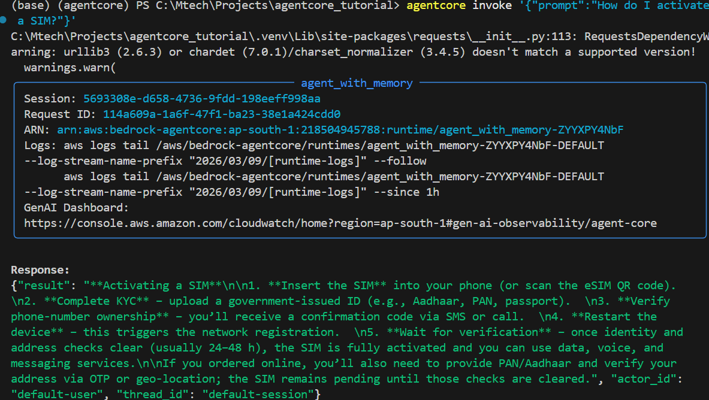
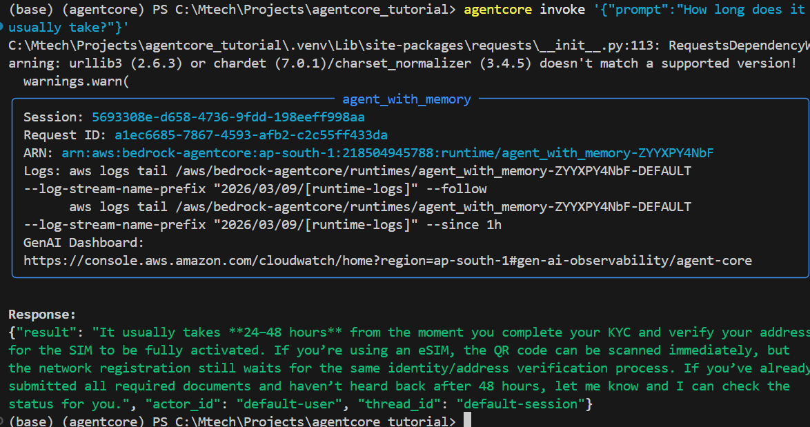

# AgentCore Memory FAQ Assistant

A memory-enabled FAQ assistant built using **AWS Bedrock AgentCore**, **LangGraph**, **LangChain**, **FAISS**, and **Groq LLM**.

The system retrieves answers from a **vectorized FAQ knowledge base** and maintains **conversation memory** across sessions.

---

# Architecture Overview

The assistant consists of the following components:

- **AgentCore Runtime** – handles requests and sessions  
- **LangGraph Agent** – manages tool usage and reasoning  
- **FAISS Vector Store** – stores FAQ embeddings  
- **HuggingFace Embeddings** – converts text into vectors  
- **Groq LLM** – generates responses  
- **AgentCore Memory**
  - Conversation memory (`AgentCoreMemorySaver`)
  - Long-term memory (`AgentCoreMemoryStore`)

---

# System Architecture


---

# Project Structure

```
agentcore_tutorial/
│
├── qna.csv
├── main.py
├── README.md
├── screenshots/
│   ├── activation_query.png
│   └── followup_query.png
```

---

# Running the Agent

Invoke the agent using:

```bash
agentcore invoke '{"prompt":"How do I activate a SIM?"}'
```

Example follow-up question:

```bash
agentcore invoke '{"prompt":"How long does it usually take?"}'
```

Because the same `thread_id` is used, the agent remembers the previous message and answers contextually.

---

# Example Output

The agent retrieves relevant entries from the FAQ dataset using FAISS and generates a response using the LLM.

---

# Screenshot: SIM Activation Query

*(Insert your first screenshot here)*



---

# Screenshot: Follow-up Question Using Memory

*(Insert your second screenshot here)*



---

# Features

- FAQ retrieval using **FAISS vector search**
- Memory-enabled conversations using **AgentCoreMemorySaver**
- Long-term memory storage using **AgentCoreMemoryStore**
- Tool-based reasoning with **LangGraph agents**
- Embeddings via **HuggingFace sentence-transformers**
- Fast LLM inference via **Groq**

---

# Tech Stack

- AWS Bedrock AgentCore
- LangGraph
- LangChain
- FAISS
- HuggingFace Embeddings
- Groq LLM
- Python

---

# Example Knowledge Entry (qna.csv)

```
question,answer
How do I activate a SIM?,Insert the SIM and complete identity verification to activate it.
How long does activation take?,SIM activation typically completes within 30 minutes unless manual verification is required.
```

---

# Author

Somesh Joshi